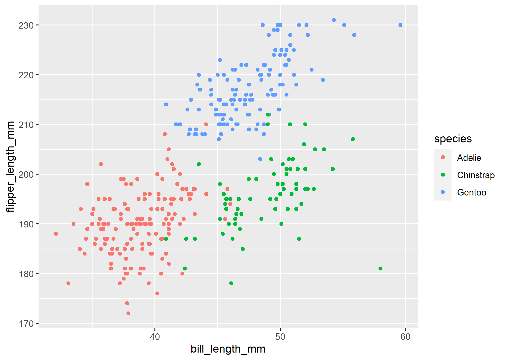

My solution of HW1 is shown below.

``` r
library(tidyverse)
```

    ## -- Attaching packages --------------------------------------- tidyverse 1.3.1 --

    ## v ggplot2 3.3.5     v purrr   0.3.4
    ## v tibble  3.1.4     v dplyr   1.0.7
    ## v tidyr   1.1.3     v stringr 1.4.0
    ## v readr   2.0.1     v forcats 0.5.1

    ## -- Conflicts ------------------------------------------ tidyverse_conflicts() --
    ## x dplyr::filter() masks stats::filter()
    ## x dplyr::lag()    masks stats::lag()

## Problem 1

Create the data frame.

``` r
p1_df = tibble(
  sample = rnorm(10,0,1),
  sp_gt_0 = sample > 0,
  char_vec = c("i", "l", "o", "v", "e", "d", "s", "a", "n", "r"),
  fact_vec = factor(c("low", "low", "med", "med", "med", "high", "high", "high", "high", "high"))
  )
```

Find the mean of each variable.

``` r
mean(pull(p1_df, sample))
```

    ## [1] -0.4294372

``` r
mean(pull(p1_df, sp_gt_0))
```

    ## [1] 0.4

``` r
mean(pull(p1_df, char_vec))
```

    ## Warning in mean.default(pull(p1_df, char_vec)): argument is not numeric or
    ## logical: returning NA

    ## [1] NA

``` r
mean(pull(p1_df, fact_vec))
```

    ## Warning in mean.default(pull(p1_df, fact_vec)): argument is not numeric or
    ## logical: returning NA

    ## [1] NA

I can compute the mean of the sample and logical vector. But it doesn’t
work for character vector and factor vector.

Use ‘as.numeric’

``` r
as.numeric(pull(p1_df, sample))
```

    ##  [1] -0.7743567 -2.2232365 -1.4473808  0.5435977  0.1305401  1.1332038
    ##  [7] -0.3477208  0.5298657 -0.6986647 -1.1402203

``` r
as.numeric(pull(p1_df, sp_gt_0))
```

    ##  [1] 0 0 0 1 1 1 0 1 0 0

``` r
as.numeric(pull(p1_df, char_vec))
```

    ## Warning: NAs introduced by coercion

    ##  [1] NA NA NA NA NA NA NA NA NA NA

``` r
as.numeric(pull(p1_df, fact_vec))
```

    ##  [1] 2 2 3 3 3 1 1 1 1 1

The elements of logical vector and factor vector change to numerical
number. The elements of character vector change to NA, because character
variables have no obvious comparability. That’s also why the mean
doesn’t work for it.

## Problem 2

Load the ‘penguins’ dataset.

``` r
data("penguins", package = "palmerpenguins")
```

Show the information of ‘penguins’ dataset.

``` r
names(penguins)
```

    ## [1] "species"           "island"            "bill_length_mm"   
    ## [4] "bill_depth_mm"     "flipper_length_mm" "body_mass_g"      
    ## [7] "sex"               "year"

``` r
print(penguins)
```

    ## # A tibble: 344 x 8
    ##    species island    bill_length_mm bill_depth_mm flipper_length_mm body_mass_g
    ##    <fct>   <fct>              <dbl>         <dbl>             <int>       <int>
    ##  1 Adelie  Torgersen           39.1          18.7               181        3750
    ##  2 Adelie  Torgersen           39.5          17.4               186        3800
    ##  3 Adelie  Torgersen           40.3          18                 195        3250
    ##  4 Adelie  Torgersen           NA            NA                  NA          NA
    ##  5 Adelie  Torgersen           36.7          19.3               193        3450
    ##  6 Adelie  Torgersen           39.3          20.6               190        3650
    ##  7 Adelie  Torgersen           38.9          17.8               181        3625
    ##  8 Adelie  Torgersen           39.2          19.6               195        4675
    ##  9 Adelie  Torgersen           34.1          18.1               193        3475
    ## 10 Adelie  Torgersen           42            20.2               190        4250
    ## # ... with 334 more rows, and 2 more variables: sex <fct>, year <int>

``` r
nrow(penguins)
```

    ## [1] 344

``` r
ncol(penguins)
```

    ## [1] 8

``` r
mean(pull(penguins, flipper_length_mm), na.rm = TRUE)
```

    ## [1] 200.9152

Make a scatterplot and export it.

``` r
peng_sp = ggplot(penguins,aes(x = bill_length_mm,y = flipper_length_mm, color = species)) + geom_point()
ggsave("peng_sp.png")
```

    ## Saving 7 x 5 in image

    ## Warning: Removed 2 rows containing missing values (geom_point).

``` r

```


